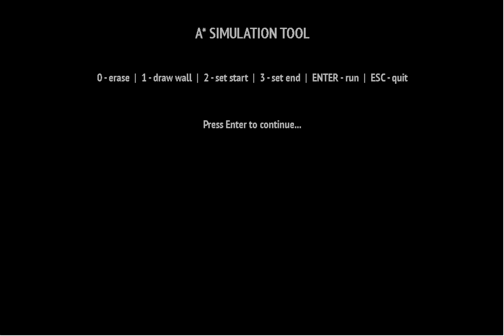
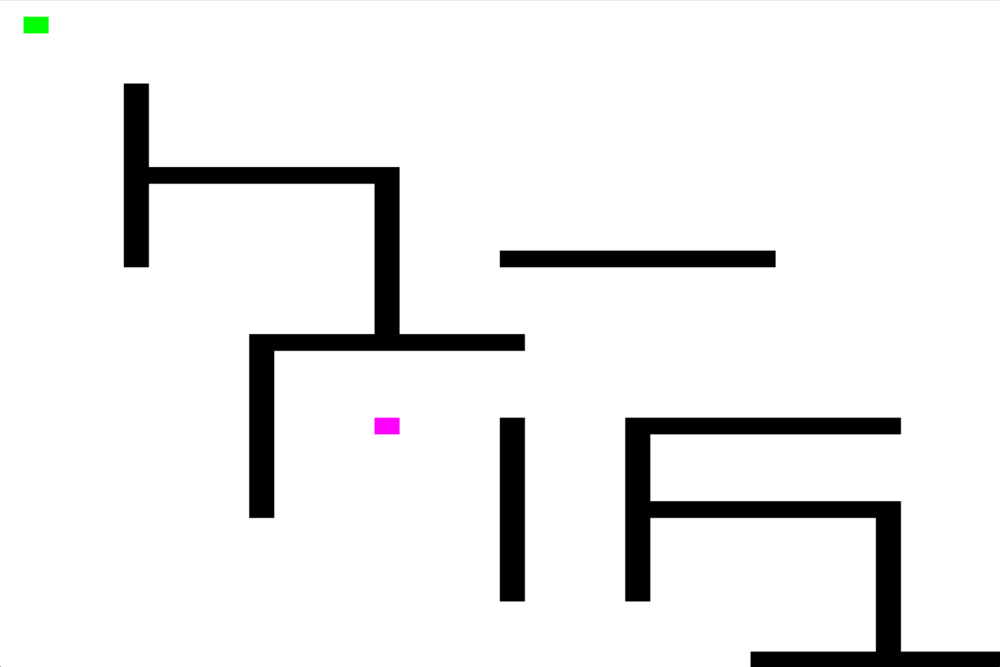
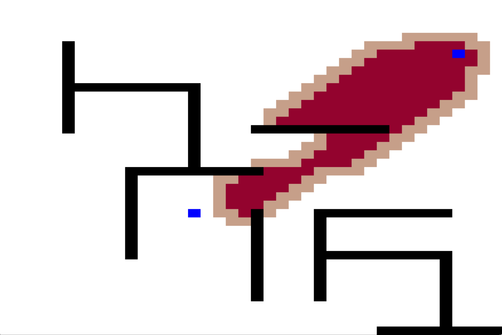
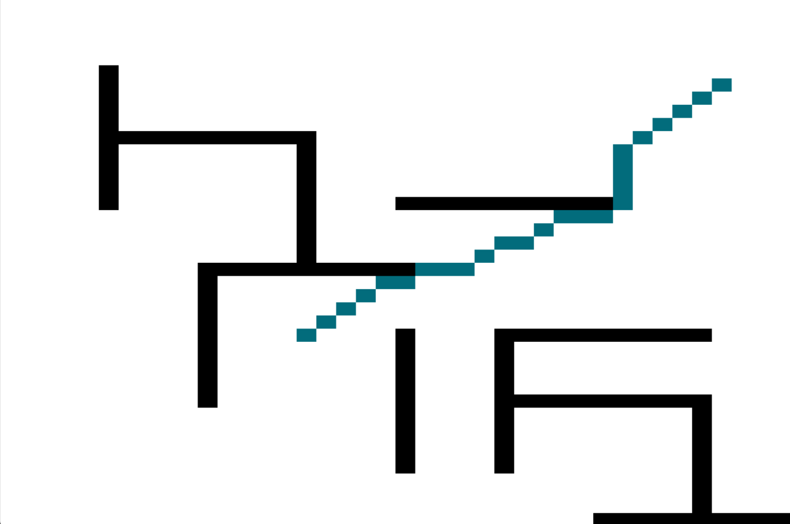

# A* Algorithm Visualisation Program

The current executable in the repo is compiled for **Windows**.

To run the project, compile the source files with the **SDL2 library**, the **SDL2_ttf extension**, and include the following files:
- `SDL2.dll`
- `SDL2_ttf.dll`
- Font files  `*.ttf`

---

## OVERVIEW

<ul>

<li><b>1. Menu</b>  
This is the main menu of the application.
  

</li>

<li><b>2. Simulation</b>
<ul>

<li><b>2.1 Main View</b>  
You can draw the labyrinth as you like, then press <kbd>Enter</kbd> to run the simulation.
  

</li>

<li><b>2.2 Visited & Priority Queue</b>  
The light-brown colored grid elements are those added to the **priority queue** for evaluation.  
The dark-red colored grid elements are those **already evaluated and visited** by the algorithm.
  

</li>

<li><b>2.3 Final Path</b>  
At the end, the <strong>shortest path</strong> between the start and end points is marked in <strong>blue</strong>.
  

</li>

</ul>
</li>

</ul>
