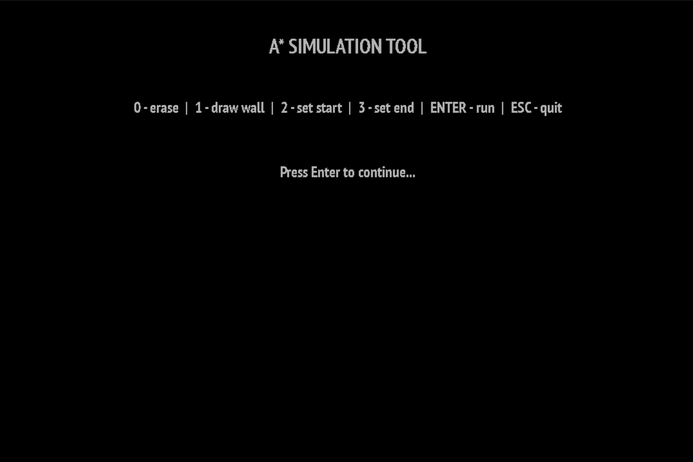

Welcome to A* algorithm visualisation program

The current executable in the repo is compiled for Windows.

To run the project, compile the source files with the SDL2 library, the SDL2_ttf extension library, and include `SDL2.dll`, `SDL2_ttf.dll`, and font files.

---

## OVERVIEW

<ul>  
<li>
<b>Menu:</b> 

</li>

<li>
<b>Simulation:</b> 

<ol>
<li>You can draw the labyrinth as you like, then press Enter to run.</li>

<li>
 
The light-brown colored grid elements are those added to the priority queue for evaluation.  
The dark-red colored grid elements are those already evaluated and visited by the algorithm.
</li>

<li>
The light-brown colored grid elements are the ones added to the priority queue for evaluation.  
The dark-red ones are already evaluated and visited.
</li>

<li>
 
At the end, the shortest path between two points is marked in blue.
</li>
</ol>
</li>
</ul>
